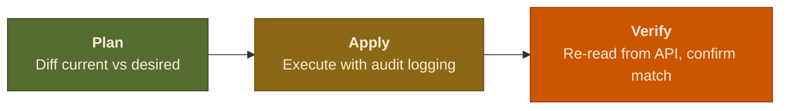

<div align="center">


[](https://rust-lang.org)
[](LICENSE)
[](https://github.com/OriginalMHV/Ward/actions)
[](https://crates.io/crates/ward-cli)
[](https://crates.io/crates/ward-cli)

[](https://github.com/OriginalMHV/Ward)
[](https://github.com/OriginalMHV/Ward/actions)
[](docs/commands.md)
[](https://github.com/OriginalMHV/Ward/releases/latest)

[Install](#install) · [Quick Start](#quick-start) · [Docs](#documentation) · [Contributing](CONTRIBUTING.md)

</div>

---

## What is Ward?

Ward is a Rust CLI that treats GitHub repository management as infrastructure-as-code. Declare your desired state in `ward.toml`, diff it against reality, apply changes, and verify the result. No shell scripts, no cloning, no guessing.

### Features

<details>
<summary><b>Security management</b> -- Dependabot, secret scanning, push protection across repos in one command</summary>

```bash
ward security plan --system backend       # preview changes
ward security apply --system backend      # apply + auto-verify
ward security audit --system backend      # current posture
```

Manages: Dependabot alerts, Dependabot security updates, secret scanning, AI detection, push protection, CodeQL.

</details>

<details>
<summary><b>Branch protection</b> -- declarative rules for PRs, approvals, status checks</summary>

```bash
ward protection plan --system backend     # diff current vs desired
ward protection apply --system backend    # apply to default branches
```

Configure required approvals, dismiss stale reviews, code owner reviews, status checks, force-push policies, and more in `ward.toml`.

</details>

<details>
<summary><b>Template commits</b> -- deploy workflow configs via the Git Trees API (no cloning)</summary>

```bash
ward commit plan --template dependabot --system backend
ward commit apply --template codeql --system backend
```

Built-in templates: `dependabot`, `codeql`, `dependency-submission`. Auto-detects Gradle vs npm and extracts Java/Node versions. Add your own with `.tera` files in `~/.ward/templates/`.

</details>

<details>
<summary><b>Drift detection</b> -- compare actual state against desired config, designed for CI</summary>

```bash
ward drift check --system backend         # exit code 1 on drift
ward drift check --system backend --json  # machine-readable
```

Checks security settings and branch protection. Use in GitHub Actions to catch config drift before it causes incidents.

</details>

<details>
<summary><b>Unified plan</b> -- full compliance posture across all features in one command</summary>

```bash
ward plan --system backend                # one system
ward plan --all                           # every system
ward plan --all --json                    # CI-friendly output
```

Runs security, branch protection, rulesets, and team access checks together. The "terraform plan" of Ward.

</details>

<details>
<summary><b>Policy engine</b> -- define org-wide rules and fail CI on violations</summary>

```bash
ward policy list                          # show configured rules
ward policy check --system backend        # exit code 1 on errors
```

```toml
[[policies]]
name = "no-public-repos"
rule = "visibility != 'public'"
severity = "error"
```

Supports boolean checks, negation, numeric comparisons, and string matching.

</details>

<details>
<summary><b>Rulesets</b> -- manage GitHub repository rulesets (branch protection successor)</summary>

```bash
ward rulesets plan --system backend       # preview changes
ward rulesets apply --system backend      # create or update
ward rulesets audit --system backend      # show current state
```

</details>

<details>
<summary><b>Team access</b> -- manage team permissions across repositories</summary>

```bash
ward teams list --system backend          # current access matrix
ward teams plan --system backend          # preview changes
ward teams apply --system backend         # add, update, or remove
```

</details>

<details>
<summary><b>Import</b> -- reverse-engineer an existing org into ward.toml</summary>

```bash
ward import --org my-github-org           # auto-detect systems
ward import --org my-github-org --stdout  # print without writing
```

Detects systems by repo name prefix, samples security and protection state via majority vote, discovers team access patterns.

</details>

<details>
<summary><b>Interactive TUI</b> -- terminal dashboard for browsing and applying changes</summary>

```bash
ward tui
```

Browse repos, view security state, apply settings, filter by name -- all from a keyboard-driven terminal UI. Tab between systems, apply to individual repos or in bulk.

</details>

<details>
<summary><b>Rollback & audit trail</b> -- every mutation logged, reversible</summary>

```bash
ward rollback --last 10 --dry-run         # preview reversal
ward rollback --last 5 --yes              # undo last 5 changes
ward audit --system backend --format json # compliance report
```

All mutations logged to `~/.ward/audit.log` as JSON lines. Query with `jq`.

</details>

## Install

```bash
# from crates.io (recommended)
cargo install ward-cli

# homebrew (macOS / Linux)
brew install OriginalMHV/tap/ward-cli

# shell script (macOS / Linux)
curl --proto '=https' --tlsv1.2 -LsSf https://github.com/OriginalMHV/Ward/releases/latest/download/ward-cli-installer.sh | sh

# powershell (Windows)
powershell -ExecutionPolicy ByPass -c "irm https://github.com/OriginalMHV/Ward/releases/latest/download/ward-cli-installer.ps1 | iex"

# from source
git clone https://github.com/OriginalMHV/Ward.git
cd Ward && cargo install --path .
```

Requires Rust >= 1.85 (source install only) and a GitHub token (`GH_TOKEN`, `GITHUB_TOKEN`, or `gh auth token`).
Token scopes needed: `repo`, `read:org`, `workflow`.

<details>
<summary><b>Shell completions</b></summary>

```bash
ward completions bash > ~/.bash_completion.d/ward
ward completions zsh  > ~/.zfunc/_ward
ward completions fish > ~/.config/fish/completions/ward.fish
```

</details>

## Quick Start

```bash
ward init                               # interactive setup wizard
vim ward.toml                           # review and adjust config
ward repos list --system backend        # see what's out there
ward security plan --system backend     # dry-run: what would change?
ward security apply --system backend    # apply + auto-verify
```

Use `ward init --non-interactive` to scaffold a minimal `ward.toml` without the wizard.

## Documentation

| Guide | Description |
|-------|-------------|
| [Configuration](docs/configuration.md) | `ward.toml` format, systems, overrides |
| [Commands](docs/commands.md) | Full CLI reference |
| [Templates](docs/templates.md) | Built-in and custom Tera templates |
| [TUI Dashboard](docs/tui.md) | Interactive terminal interface |
| [CI Integration](docs/ci-integration.md) | Using Ward in GitHub Actions |
| [Architecture](docs/architecture.md) | How Ward works under the hood |

## How it works



- **No git cloning** -- file commits use the Git Trees API (blob, tree, commit, update ref). Atomic, no filesystem side effects.
- **Idempotent** -- detects existing state and skips what's already done.
- **Audit log** -- every mutation logged to `~/.ward/audit.log` as JSON lines. Query with `jq`.
- **Custom templates** -- place `.tera` files in `~/.ward/templates/` to add or override built-in templates. Uses [Tera](https://keats.github.io/tera/) (Jinja2-compatible).

---

## Contributing

See [CONTRIBUTING.md](CONTRIBUTING.md) for setup and workflow details.

```bash
cargo fmt && cargo clippy --tests -- -D warnings && cargo test
```

## License

MIT. See [LICENSE](LICENSE).


