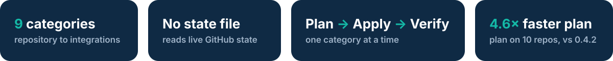
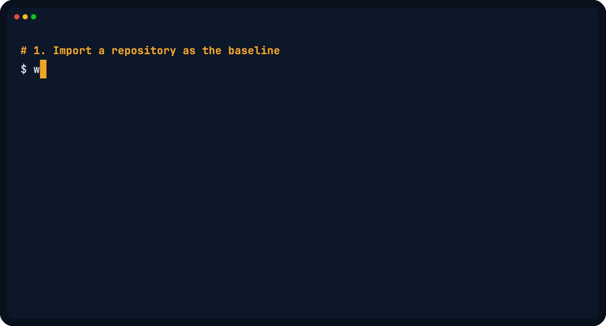
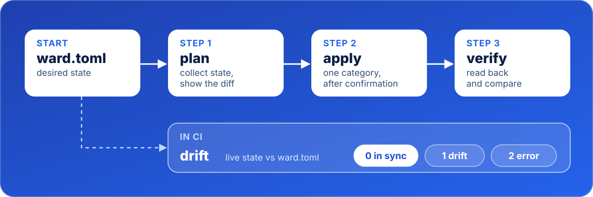

<div align="center">


<br>

[](https://github.com/OriginalMHV/Ward/actions/workflows/ci.yml)
[](https://crates.io/crates/ward-cli)
[](https://www.rust-lang.org)
[](LICENSE)

</div>

> This README describes Ward 0.5.0. For the released 0.4.2, see the [v0.4.2 README](https://github.com/OriginalMHV/Ward/blob/v0.4.2/README.md).

<p align="center">
  
</p>

<p align="center">
  
</p>

## Why Ward

- **One manifest for many repositories.** `ward.toml` describes the desired state for a whole organization or a set of systems.
- **Plan before any change.** `ward plan` is read-only. `ward apply` runs one category at a time, and each category has its own safety boundary.
- **Verify after apply.** Ward reads the state back from GitHub and checks it against the manifest.
- **Drift checks for CI.** `ward drift` exits with `0` (in sync), `1` (drift) or `2` (could not run).
- **Start from what you have.** `ward import` turns an existing repository into your baseline manifest.
- **Measured speed.** On 10 repositories, `ward plan` took 131 s in 0.4.2 and 29 s in 0.5.0.

## Install

```bash
# crates.io
cargo install ward-cli

# Homebrew (macOS and Linux)
brew install OriginalMHV/tap/ward-cli

# Shell installer (macOS and Linux)
curl --proto '=https' --tlsv1.2 -LsSf \
  https://github.com/OriginalMHV/Ward/releases/latest/download/ward-cli-installer.sh | sh

# PowerShell (Windows)
powershell -ExecutionPolicy ByPass -c "irm https://github.com/OriginalMHV/Ward/releases/latest/download/ward-cli-installer.ps1 | iex"
```

Building from source needs Rust 1.88 or newer. Ward reads its token from `GH_TOKEN`, `GITHUB_TOKEN` or `gh auth token`. Run `ward doctor` to check your setup. The [GitHub coverage](docs/github-coverage.md) page lists the permissions each category needs.

## Quick start

```bash
ward import OWNER/REPO                 # write ward.toml from an existing repository
ward plan                              # show what differs from GitHub, change nothing
ward apply --category repository       # apply one category, then verify it
```

1. `import` reads the repository through the GitHub API and writes a reviewable `ward.toml`. The source repository is the only target, so the first plan shows zero drift.
2. `plan` collects the live state, compares it with the manifest and prints the differences.
3. `apply` shows the plan, asks for confirmation, applies the category and checks the result.

Edit `ward.toml`, run `ward plan` again, and repeat. See [Getting started](docs/getting-started.md) for the full walkthrough.

## How it works

<p align="center">
  
</p>

Every category in `ward.toml` has a policy with a **disposition**:

| Disposition | Meaning |
|---|---|
| `managed` | Ward may change GitHub to match the manifest. |
| `observe` | Ward reports state and coverage. It never writes. |
| `reference` | Inherited resources, such as organization rulesets. Reported only. |
| `placeholder` | A value that lives outside the manifest, such as a secret. Reported only. |

`ward import` starts the `repository` and `files` categories as `managed`. It starts all other categories as `observe` and `sensitive`. Change a category to `managed` when you want Ward to write it. See [Configuration](docs/configuration.md#category-policies).

## Categories

Pass any of these to `--category`. Separate several with commas.

| Category | Scope |
|---|---|
| `repository` | Description, homepage, default branch, merge settings, topics, labels, custom properties, immutable releases |
| `files` | Configuration files such as `.github/**`, delivered through a pull request |
| `security` | Advanced Security, Dependabot, secret scanning, CodeQL default setup, private vulnerability reporting |
| `rulesets` | Repository rulesets with conditions, rules and bypass actors |
| `branch-protection` | Detailed protection for the default branch and every protected branch |
| `actions` | Actions policy, token permissions, retention, variables, secret names, workflow state |
| `environments` | Environment settings, reviewers, deployment policies, variables, secret names |
| `access` | Teams, collaborators, invitations, App references |
| `integrations` | Webhooks, deploy keys, Pages, autolinks |

`ward audit` supports the `security`, `rulesets`, `branch-protection` and `access` sections. See [GitHub coverage](docs/github-coverage.md) for the full matrix and the public API limits.

## Commands

| Command | Purpose |
|---|---|
| `ward import SOURCE` | Write a manifest from an existing repository. |
| `ward init` | Write a minimal `ward.toml` scaffold. |
| `ward doctor` | Check the token, the config, the audit log and API access. |
| `ward plan` | Show the changes needed to reach the desired state. Read-only. |
| `ward apply` | Apply the changes per category, then verify. Asks first, or use `--yes`. |
| `ward drift` | Compare live state with `ward.toml`. Exit code `0`, `1` or `2`. |
| `ward audit` | Report security, rulesets, branch protection and access across repositories. |
| `ward repos list` | List repositories with metadata. |
| `ward config show` | Print the current configuration. |
| `ward config edit` | Open the configuration in your editor. |
| `ward config path` | Print the path of the configuration file. |

Common options go after the subcommand: `--category C,..`, `--org`, `--system`, `--repo` and `--format text|json`. The global options are `--config`, `--parallelism` and `-v`. See the [command reference](docs/commands.md).

## Configuration

A manifest names the organization, the systems and the categories to manage:

```toml
[org]
name = "my-github-org"

[[systems]]
id = "backend"
name = "Backend Services"
repos = ["backend-api", "backend-worker"]

[categories.repository.policy]
disposition = "managed"
prune = false
sensitive = false

[categories.repository.settings]
delete_branch_on_merge = true
topics = ["managed-by-ward"]
```

Start from [`ward.example.toml`](ward.example.toml) or run `ward import`. The [configuration reference](docs/configuration.md) describes every field.

## CI

Run `ward drift` on a schedule. The step fails when GitHub no longer matches `ward.toml`.

```yaml
name: Ward drift
on:
  schedule:
    - cron: "0 8 * * 1"
  workflow_dispatch:

jobs:
  drift:
    runs-on: ubuntu-latest
    steps:
      - uses: actions/checkout@v7
      - name: Install Ward
        run: |
          curl --proto '=https' --tlsv1.2 -LsSf \
            https://github.com/OriginalMHV/Ward/releases/latest/download/ward-cli-installer.sh | sh
      - name: Check drift
        env:
          GH_TOKEN: ${{ secrets.WARD_TOKEN }}
        run: ward drift --format json
```

| Exit code | Meaning |
|---|---|
| `0` | Every repository matches `ward.toml`. |
| `1` | Drift found. This includes blocked or deferred changes and unreadable state in managed categories. |
| `2` | Ward could not run the check. Authentication, network, config or arguments are wrong. |

JSON goes to stdout and progress goes to stderr. See [CI integration](docs/ci-integration.md) for more patterns.

## Ward compared with other tools

| | Ward | [Terraform GitHub provider](https://github.com/integrations/terraform-provider-github) | [Probot Settings](https://github.com/repository-settings/app) | [safe-settings](https://github.com/github/safe-settings) |
|---|---|---|---|---|
| Runs as | CLI, locally or in CI | Terraform provider | GitHub App, hosted or self-hosted | Server (Docker, Kubernetes), Lambda or GitHub Action |
| State file | None. Reads live GitHub state each run. | Yes, Terraform state | None | None |
| Preview before change | `ward plan` | `terraform plan` | Not documented in its README | Yes, dry run on pull requests (nop mode) |
| Drift detection | `ward drift`, exit codes for CI | `terraform plan` shows it | Not documented in its README | Yes, scheduled and on webhook events |
| Import an existing repository | `ward import` | Per-resource `terraform import` | Not documented in its README | Yes, a settings generator script |
| Scope | Repository, files, security, rulesets, branch protection, Actions, environments, access, integrations | Broad. Repositories, teams, org settings, rulesets, Actions, webhooks and more | Repository settings from `.github/settings.yml` | Org, suborg and repository settings in an admin repository |
| Many repositories | One manifest with systems | Yes, with modules and loops | Per repository, or one install for an org | Yes, at org, suborg and repository levels |
| Learning curve | One TOML file and five commands | Terraform language, providers and state | Low. One YAML file. | Medium. Needs a deployed service. |

The Terraform provider has broader resource coverage and an explicit state file. If you already run Terraform, it fits that workflow. The two apps run continuously and react to events. Ward is a CLI that you run on demand or in CI, and it needs no deployed service. A cell marked "Not documented" means the project README does not say. It does not mean the feature is missing.

## Safety

- **No global apply-all.** `ward apply` works one category at a time, in a fixed safe order, and shows the plan first.
- **Sensitive categories are gated.** They need `sensitive = true` and `disposition = "managed"` before Ward writes them.
- **Secret values stay out of Ward.** Ward never reads secret values from GitHub, and never stores them in the manifest, the plan or the audit log. It resolves each value from your environment only when it writes.
- **Audit log.** Every change is appended to `~/.ward/audit.log`. On Windows this is `.ward\audit.log` in your user profile folder.
- **A missing list is never pruned.** If `teams` or `collaborators` is absent from the manifest, Ward leaves them alone. Only an explicit list with `prune = true` removes entries.
- **No repository lifecycle.** Ward never creates, renames, transfers or deletes repositories. Visibility and archive changes need `--allow-high-impact` or `sensitive = true` on the repository category.
- **Files go through pull requests.** Ward never pushes managed files to the default branch.

## Documentation

| Guide | Description |
|---|---|
| [Getting started](docs/getting-started.md) | Set up a manifest, review it, plan and apply |
| [Commands](docs/commands.md) | Full CLI reference |
| [Configuration](docs/configuration.md) | Categories, policies, references and placeholders |
| [GitHub coverage](docs/github-coverage.md) | Supported settings and API limits |
| [Architecture](docs/architecture.md) | Collectors, planning, ordering and verification |
| [CI integration](docs/ci-integration.md) | Run Ward in GitHub Actions |
| [Changelog](CHANGELOG.md) | Release notes and breaking changes |

## Contributing

Read [CONTRIBUTING.md](CONTRIBUTING.md) first. Before you open a pull request, run:

```bash
cargo fmt -- --check
cargo clippy --all-targets -- -D warnings
cargo test --all-targets
```

Report security issues as described in [SECURITY.md](SECURITY.md).

## License

MIT. See [LICENSE](LICENSE).
